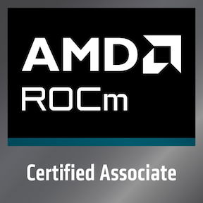

# Athos Figueiredo

**Creative Director · Art Director · Creative Developer · Interactive 3D · Motion and Video · AI Creative Technology**

I connect creative direction with hands-on development to build brands, motion systems, audiovisual work and interactive digital experiences. My work combines design judgment with HTML/CSS, JavaScript, Three.js, WebGL, GLB/glTF workflows and generative AI.

## Current focus

- Creative development and interactive 3D for the web
- Three.js, WebGL, real-time rendering and PBR workflows
- Motion design, video editing and audiovisual direction
- Generative AI with human review and traceable decisions
- GPU computing and AI foundations with AMD ROCm

## Selected work

- **Figueira Atlas Vivo:** interactive 3D experience for a healthcare communication platform
- **BriefKeeper:** browser-based voice and text briefing tool with local-first review
- **PatientKeeper:** bilingual scheduling prototype that preserves continuity and change history
- **SiteCheck:** browser-based visual and accessibility QA with exportable evidence
- **FIGLAB:** visual translation of technical and scientific knowledge

## Credential

  

[AMD ROCm Certified Associate](https://www.credly.com/badges/2d19518c-64b6-4ca8-8997-2d6d1f059a97/public_url), issued September 2026

## Links

- [Portfolio](https://figueirart.com)
- [LinkedIn](https://www.linkedin.com/in/athus/)
